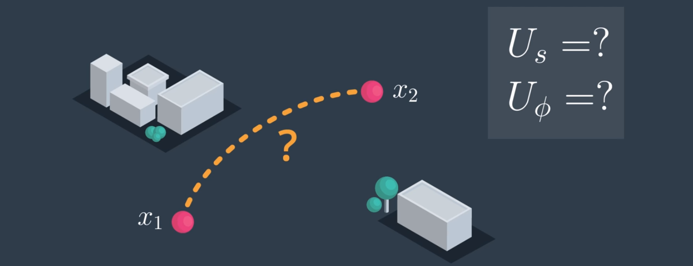

# AAE_Notebook_017_Steering
In the last notebook, we wrote a method called 'simulate' that allows us to predict where the vehicle will end up given an initial state, some controls, a steering angle, and velocity. Now, let's actually incorporate it into our planner.

In the probabilistic roadmap notebook, we assumed that we could get from any state to any other state along a straight light, so long as obstacles weren't in the way. That is, given sample states X1 and X2, we can draw an edge and decide if that edge is valid if not any kinematic constraint is violated. In doing this, we ignored orientation, velocity, inertia, and even what the controls needed to be in order to make the edge happen.

Now, because we have more complicated differential constraints, to see if you can add an edge between two states you need to know which controls can get you from X1 to X2. In other words, you need to know what setting of the velocity and steering angle you need.

Given a pair of states, X1 and X2, solving for the controls that give us the solution, in general, is a two-point boundary value problem in differential equations and can be very difficult to solve for a lot of real systems. There may even be multiple solutions, some of which are collision-free and some of which are not. Instead of trying to solve the boundary value problem, which can be as difficult as the original planning problem, let us randomly guess at a set of controls and see how close we get to X2...
